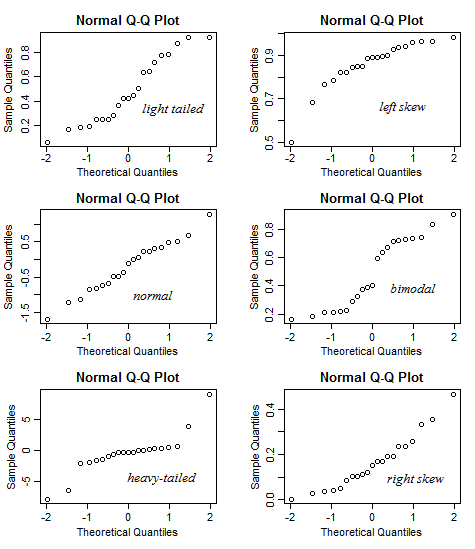

## May 8th, 2017

### Model Evaluation
There are two methods of evaluating models, Hold-Out and Cross-Validation.

#### Hold-Out
In this method, the dataset is randomly divided to three subsets:
- **Training set** is a subset of the dataset used to build predictive models.
- **Validation set** is a subset of the dataset used to assess the performance of model built in the training phase. It provides a test platform for fine tuning model's parameters and selecting the best-performing model.
- **Test set** or unseen examples is a subset of the dataset to assess the likely future performance of a model. If a model fit to the training set much better than it fits the test set, overfitting is probably the cause.

#### Cross-Validation
When only a limited amount of data is available, to achieve an unbiased estimate of the model performance we use k-fold cross-validation. In k-fold cross-validation, we divide the data into k subsets of equal size. We build models k times, each time leaving out one of the subsets from training and use it as the test set. If k equals the sample size, this is called "leave-one-out".

---

### Regression
#### Coefficient of Determination
The coefficient of determination (R-squared) summarizes the explanatory power of the regression model and is computed from the sums-of-squares terms. R-squared describes the proportion of variance of the dependent variable explained by the regression model. If the regression model is “perfect”, SSE is zero, and R-squared is 1. If the regression model is a total failure, SSE is equal to SST, no variance is explained by regression, and R-squared is zero.

#### Standardized Residuals (Errors) Plot
The standardized residual plot is a useful visualization tool in order to show the residual dispersion patterns on a standardized scale. There are no substantial differences between the pattern for a standardized residual plot and the pattern in the regular residual plot. The only difference is the standardized scale on the y-axis which allows us to easily detect potential outliers.

---

### Classification
#### Confusion Matrix
A confusion matrix shows the number of correct and incorrect predictions made by the classification model compared to the actual outcomes (target value) in the data. The matrix is NxN, where N is the number of target values (classes). Performance of such models is commonly evaluated using the data in the matrix. The following table displays a 2x2 confusion matrix for two classes (Positive and Negative).

- **Accuracy** : the proportion of the total number of predictions that were correct.
- **Positive Predictive Value or Precision** : the proportion of positive cases that were correctly identified.
- **Negative Predictive Value** : the proportion of negative cases that were correctly identified.
- **Sensitivity or Recall** : the proportion of actual positive cases which are correctly identified. 
- **Specificity** : the proportion of actual negative cases which are correctly identified. 

#### ROC curve
A curve used for evaluating results of a classification algorithm. A model that guesses randomly would always show a straight line from the origin. 

Reminder: 
 - **Recall** = Sensitivity = TP/(TP + FN)   
 - **Specificity** = TN/(TN + FP)
 
 AUC = Area Under Curve

#### Q-Q Plot
The quantile - quantile plot. A tool to help assess whether a set of data plausibly fits a theoretical distribution (like a normal distribution). A visual check and is somewhat subjective. Allows us to see if our assumption is plausible and what datapoints do or don't agree with the distribution. If the data fits the theoretical distribution, the line should be somewhat straight.

